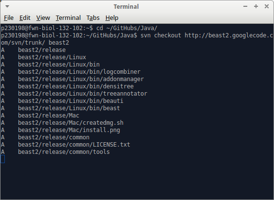
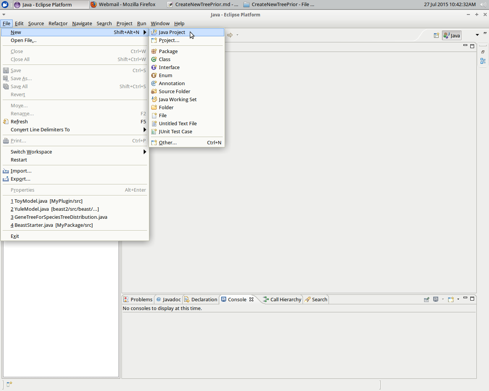
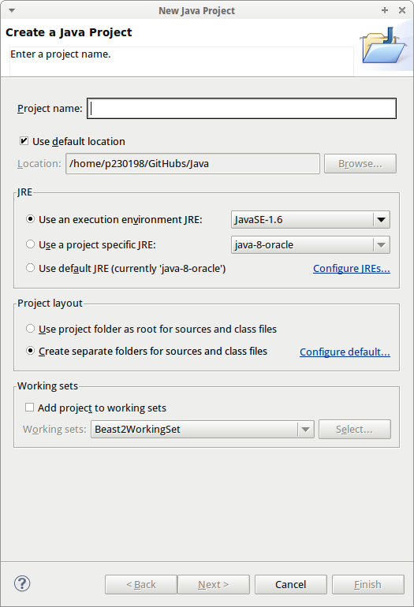
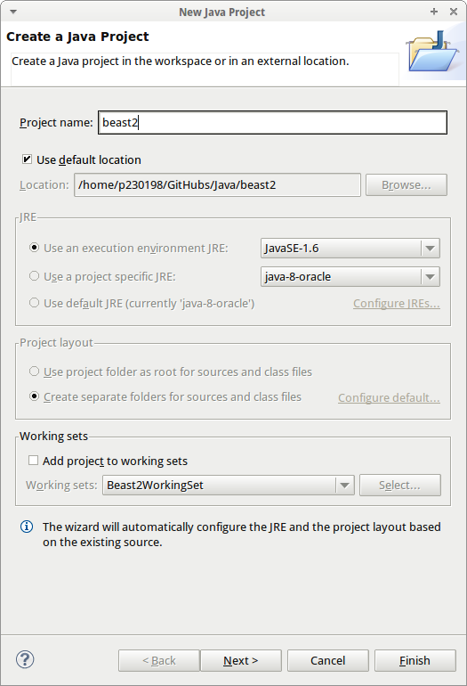
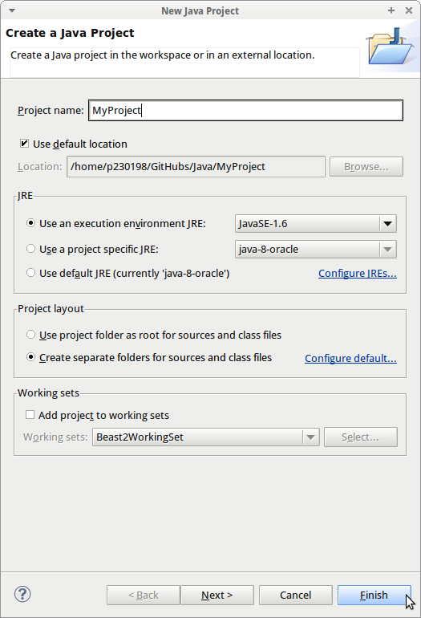
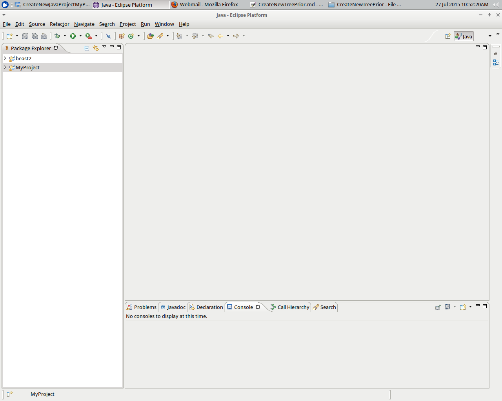
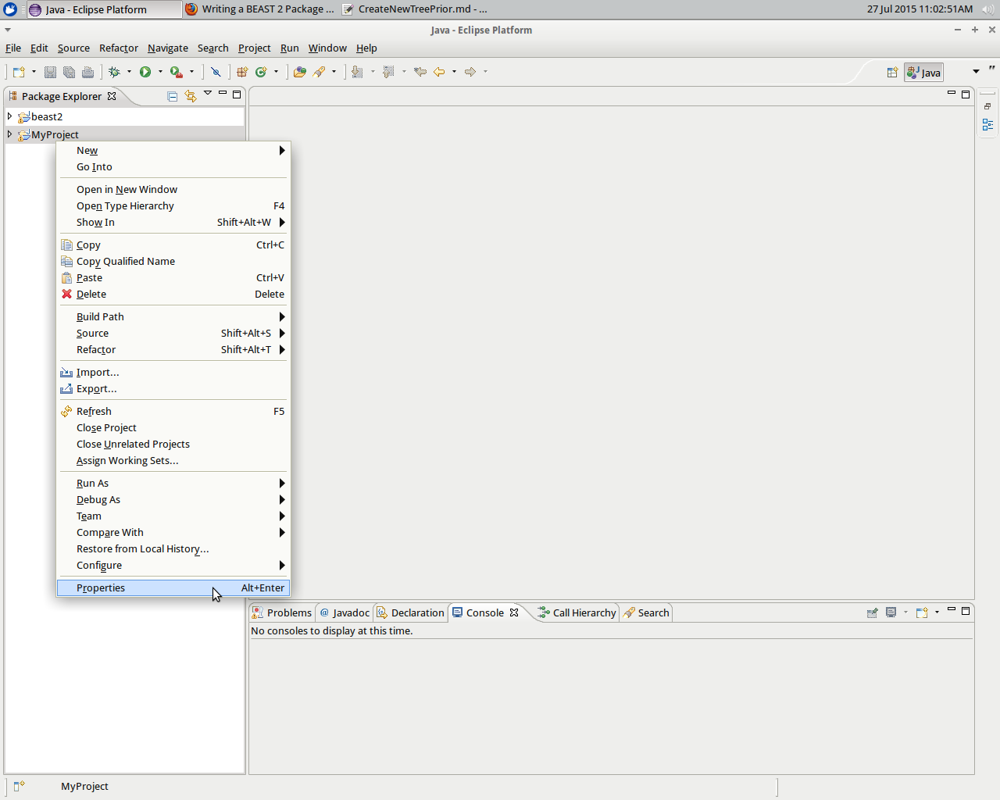
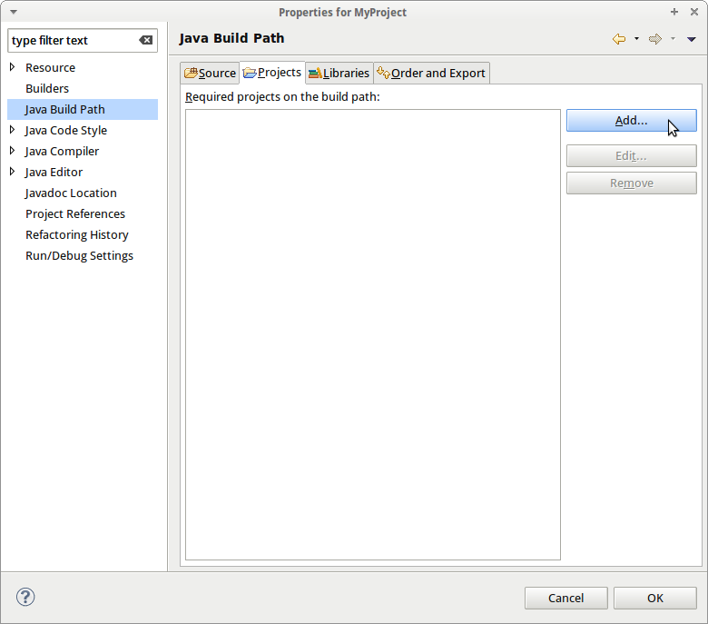
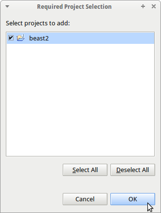
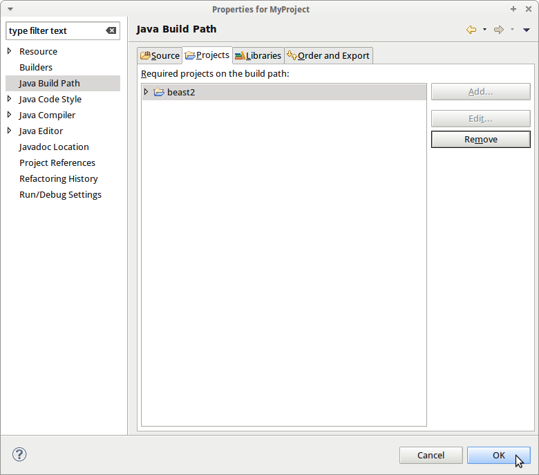

# How to add a tree prior to BEAST2?

This tutorial follows the same wording and structure as [BEAST2: how to write a BEAST2 package](http://beast2.org/writing-a-beast-2-package), but for a tree prior instead.

## Empty Package Explorer

When starting Eclipse in a new workspace, the Package Explorer is still empty. In this example, my workspace is `~/GitHubs/Java`.

## Adding BEAST2 to the Package Explorer

To add BEAST2 to the Package Explorer, it must first be downloaded, then put into a Java project.

### Download BEAST2

In this example, I download BEAST2 from the SVN repository from withing the `~/GitHubs/Java' folder:

`
cd ~/GitHubs/Java
svn checkout http://beast2.googlecode.com/svn/trunk/ beast2
`
This will create a folder called `beast2`.

### Put BEAST2 into a Java project

First, we will add `beast2` to the Package Explorer.

Select `File | New | Java Project`:

This is how the 'Create a Java Project dialog` looks like:

Just type in the word `beast`. It will detect there is a folder called `beast2` and the dialog will change:

Just press `Finish`.

Now, the Eclipse Package Explorer shows the project `beast2`. Well done!

## Creating your own project

Now you need to create an Eclipse project for your package and make it depend on the `beast2` project.

Select `File | New | Java Project`:

In `Project name`, type in the name, for example `MyProject`. For the JRE, be sure `JavaSE-1.6` or something higher is checked. Click Finish.

Now you should see two projects in the Package Explorer pane: `beast2` and `MyProject`.

## Add BEAST2 to your own project

Right-click `MyProject` and choose `Properties` from the pop-up menu that appears

Go to `Java build path | Projects` and click `Add`.

Add `beast2` to your project build path:

Now BEAST2 is in your project build path, click `OK`.

This takes you back to the Package Explorer pane.

## Add 

Creating a package for “MyPackage”

With “MyPackage” selected in the Project Explorer, use File > New > Package to create a package. The Source folder for the package should be automatically filled in correctly (“MyPackage/src”), and the name should be set to “beast.evolution.substitutionmodel”. If Eclipse does not allow you to press the Finish button, cancel the dialog box, locate “beast.evolution.substitutionmodel” in the “beast2″ project, copy it, then try again to create the package, this time pasting in “beast.evolution.substitutionmodel”.
Creating an F84 class

Now right-click (or Control-click) on the “beast.evolution.substitutionmodel” package under “MyPackage” and choose New > Class from the resulting popup menu. Give the new class the name “F84″ and press Finish. You should now see the F84.java file open in the editor, and it should contain the following text: package beast.evolution.substitutionmodel;
public class F84 {

}
1
2
3
	
public class F84 {
 
}

Add “extends SubstitutionModel.Base” following the class name to produce the following:
package beast.evolution.substitutionmodel;

public class F84 extends SubstitutionModel.Base {

}
1
2
3
4
5
	
package beast.evolution.substitutionmodel;
 
public class F84 extends SubstitutionModel.Base {
 
}

At this point you should see an icon beside the class declaration. The icon consists of a light bulb with a red square containing a white letter X. Clicking this should bring up a popup menu that allows you to Add unimplemented methods. Your F84.java file should now look like this:
package beast.evolution.substitutionmodel;

import beast.evolution.datatype.DataType;
import beast.evolution.tree.Node;

public class F84 extends SubstitutionModel.Base {

	@Override
	public void getTransitionProbabilities(Node node, double fStartTime,
			double fEndTime, double fRate, double[] matrix) {
		// TODO Auto-generated method stub

	}

	@Override
	public EigenDecomposition getEigenDecomposition(Node node) {
		// TODO Auto-generated method stub
		return null;
	}

	@Override
	public boolean canHandleDataType(DataType dataType) throws Exception {
		// TODO Auto-generated method stub
		return false;
	}
}
1
2
3
4
5
6
7
8
9
10
11
12
13
14
15
16
17
18
19
20
21
22
23
24
25
26
	
package beast.evolution.substitutionmodel;
 
import beast.evolution.datatype.DataType;
import beast.evolution.tree.Node;
 
public class F84 extends SubstitutionModel.Base {
 
	@Override
	public void getTransitionProbabilities(Node node, double fStartTime,
			double fEndTime, double fRate, double[] matrix) {
		// TODO Auto-generated method stub
 
	}
 
	@Override
	public EigenDecomposition getEigenDecomposition(Node node) {
		// TODO Auto-generated method stub
		return null;
	}
 
	@Override
	public boolean canHandleDataType(DataType dataType) throws Exception {
		// TODO Auto-generated method stub
		return false;
	}
}

Note: depending on your particular version of Eclipse (or some other as-yet-unidentified factor), the methods that appear may not be in the order listed above. These are methods that must be implemented because they are abstract methods in the SubstitutionModel.Base base class.
Adding the k parameter

The F84 model comprises nucleotide frequency parameters as well as a parameter k that determines the number of extra transition-type substitutions (above and beyond those generated by the general substitution process). If k equals zero, then the F84 model collapses to the F81 model, which allows nucleotide composition to vary but does not allow transition/transversion bias. As k becomes larger, transitions become more common. The nucleotide frequencies are supplied by the base class, but the k parameter is unique to the F84 model and thus must be defined by our package class. To do this, add the following line to the class definition just after public class:
F84 extends SubstitutionModel.Base {
   public Input<RealParameter> kF84 = new Input<RealParameter>("kF84", "k parameter in the F84 model", Validate.REQUIRED);
   .
   .
   .
}
1
2
3
4
5
6
	
F84 extends SubstitutionModel.Base {
   public Input<RealParameter> kF84 = new Input<RealParameter>("kF84", "k parameter in the F84 model", Validate.REQUIRED);
   .
   .
   .
}

Adding the kF84 parameter will require you to insert some declarations at the top of the file. Eclipse helps you do this:

o First, save the file

o Click the light-bulb icon to get a popup menu, and double-click the first item in the popup menu: Import ‘Input’ (beast.core).

o Continue clicking the light-bulb icon until you have all three of these declarations inserted:
import beast.core.Input;
import beast.core.Input.Validate;
import beast.core.parameter.RealParameter;
1
2
3
	
import beast.core.Input;
import beast.core.Input.Validate;
import beast.core.parameter.RealParameter;

Adding the initAndValidate method

We must also override the initAndValidate method, within which a call to the super method allows initialization of the base class.
   @Override
   public void initAndValidate() throws Exception {
   	super.initAndValidate();
   	kF84.get().setBounds(0.0, Double.POSITIVE_INFINITY);
   }
1
2
3
4
5
	
   @Override
   public void initAndValidate() throws Exception {
   	super.initAndValidate();
   	kF84.get().setBounds(0.0, Double.POSITIVE_INFINITY);
   }

Implementing the canHandleDataType method

The F84 model is a substitution model applicable only to nucleotide sequences, so replace the body of the automatically-created stub with the following:
@Override
public boolean canHandleDataType(DataType dataType) throws Exception {
   if (dataType instanceof Nucleotide) {
     return true;
   }
   throw new Exception("The F84 substitution model can only be used with nucleotide data");
}
1
2
3
4
5
6
7
	
@Override
public boolean canHandleDataType(DataType dataType) throws Exception {
   if (dataType instanceof Nucleotide) {
     return true;
   }
   throw new Exception("The F84 substitution model can only be used with nucleotide data");
}

The method now returns true if dataType is an instance of the Nucleotide class, and otherwise throws an exception with an informative message. Adding this code requires you to insert the following declaration at the top of the file:
import beast.evolution.datatype.Nucleotide;
1
	
import beast.evolution.datatype.Nucleotide;

Implementing the getEigenDecomposition method

For now, leave this method unimplemented. We will return to it later after testing the basic implementation.
Implementing the getTransitionProbabilities method

The getTransitionProbabilities method is expected to fill a 16 element vector with transition probabilities in the order AA, AC, AG, AT, CA, CC, CG, CT, GA, GC, GG, GT, TA, TC, TG, TT, where the first nucleotide in each pair is the “from” state and the second in each pair is the “to” state. Each transition probability depends on the edge length, which is measured in terms of the expected number of subsitutions. The expected number of substitutions is the product of rate (provided by fRate) and time (the difference between fEndTime and fStartTime). Note that time is viewed from the present looking toward the past, so fStartTime - fEndTime is the correct way to get the time difference. Fill in the getTransitionProbabilitiesmethod as follows:
@Override
public void getTransitionProbabilities(Node node, double fStartTime, double fEndTime, double fRate, double[] matrix) {
       double[] freqs = frequencies.getFreqs();
       double freqA = freqs[0];
       double freqC = freqs[1];
       double freqG = freqs[2];
       double freqT = freqs[3];
       double freqR = freqA + freqG;
       double freqY = freqC + freqT;

       double k = kF84.get().getValue();
       double sumPiSquared = freqA*freqA + freqC*freqC + freqG*freqG + freqT*freqT;
       double sumPiRatios = freqA*freqA/freqR + freqC*freqC/freqY + freqG*freqG/freqR + freqT*freqT/freqY;
       double mu = (1.0 - sumPiSquared) + k*(1.0 - sumPiRatios);

       double distance = (fStartTime - fEndTime) * fRate;
       double expTerm = Math.exp(-mu * distance);
       double expTermK = Math.exp(-mu * distance * (k + 1.0));

       matrix[0]  = freqA + freqA*(1.0/freqR - 1.0)*expTerm + ((freqR - freqA)/freqR)*expTermK; //AA
       matrix[1]  = freqC*(1.0 - expTerm); //AC
       matrix[2]  = freqG + freqG*(1.0/freqR - 1.0)*expTerm - (freqG/freqR)*expTermK; //AG
       matrix[3]  = freqT*(1.0 - expTerm); //AT

       matrix[4]  = freqA*(1.0 - expTerm); //CA
       matrix[5]  = freqC + freqC*(1.0/freqY - 1.0)*expTerm + ((freqY - freqC)/freqY)*expTermK; //CC
       matrix[6]  = freqG*(1.0 - expTerm); //CG
       matrix[7]  = freqT + freqT*(1.0/freqY - 1.0)*expTerm - (freqT/freqY)*expTermK; //CT

       matrix[8]  = freqA + freqA*(1.0/freqR - 1.0)*expTerm - (freqA/freqR)*expTermK; //GA
       matrix[9]  = freqC*(1.0 - expTerm); //GC
       matrix[10] = freqG + freqG*(1.0/freqR - 1.0)*expTerm + ((freqR - freqG)/freqR)*expTermK; //GG
       matrix[11] = freqT*(1.0 - expTerm); //GT

       matrix[12] = freqA*(1.0 - expTerm); //TA
       matrix[13] = freqC + freqC*(1.0/freqY - 1.0)*expTerm - (freqC/freqY)*expTermK; //TC
       matrix[14] = freqG*(1.0 - expTerm); //TG
       matrix[15] = freqT + freqT*(1.0/freqY - 1.0)*expTerm + ((freqY - freqT)/freqY)*expTermK; //TT
}
1
2
3
4
5
6
7
8
9
10
11
12
13
14
15
16
17
18
19
20
21
22
23
24
25
26
27
28
29
30
31
32
33
34
35
36
37
38
39
	
@Override
public void getTransitionProbabilities(Node node, double fStartTime, double fEndTime, double fRate, double[] matrix) {
       double[] freqs = frequencies.getFreqs();
       double freqA = freqs[0];
       double freqC = freqs[1];
       double freqG = freqs[2];
       double freqT = freqs[3];
       double freqR = freqA + freqG;
       double freqY = freqC + freqT;
 
       double k = kF84.get().getValue();
       double sumPiSquared = freqA*freqA + freqC*freqC + freqG*freqG + freqT*freqT;
       double sumPiRatios = freqA*freqA/freqR + freqC*freqC/freqY + freqG*freqG/freqR + freqT*freqT/freqY;
       double mu = (1.0 - sumPiSquared) + k*(1.0 - sumPiRatios);
 
       double distance = (fStartTime - fEndTime) * fRate;
       double expTerm = Math.exp(-mu * distance);
       double expTermK = Math.exp(-mu * distance * (k + 1.0));
 
       matrix[0]  = freqA + freqA*(1.0/freqR - 1.0)*expTerm + ((freqR - freqA)/freqR)*expTermK; //AA
       matrix[1]  = freqC*(1.0 - expTerm); //AC
       matrix[2]  = freqG + freqG*(1.0/freqR - 1.0)*expTerm - (freqG/freqR)*expTermK; //AG
       matrix[3]  = freqT*(1.0 - expTerm); //AT
 
       matrix[4]  = freqA*(1.0 - expTerm); //CA
       matrix[5]  = freqC + freqC*(1.0/freqY - 1.0)*expTerm + ((freqY - freqC)/freqY)*expTermK; //CC
       matrix[6]  = freqG*(1.0 - expTerm); //CG
       matrix[7]  = freqT + freqT*(1.0/freqY - 1.0)*expTerm - (freqT/freqY)*expTermK; //CT
 
       matrix[8]  = freqA + freqA*(1.0/freqR - 1.0)*expTerm - (freqA/freqR)*expTermK; //GA
       matrix[9]  = freqC*(1.0 - expTerm); //GC
       matrix[10] = freqG + freqG*(1.0/freqR - 1.0)*expTerm + ((freqR - freqG)/freqR)*expTermK; //GG
       matrix[11] = freqT*(1.0 - expTerm); //GT
 
       matrix[12] = freqA*(1.0 - expTerm); //TA
       matrix[13] = freqC + freqC*(1.0/freqY - 1.0)*expTerm - (freqC/freqY)*expTermK; //TC
       matrix[14] = freqG*(1.0 - expTerm); //TG
       matrix[15] = freqT + freqT*(1.0/freqY - 1.0)*expTerm + ((freqY - freqT)/freqY)*expTermK; //TT
}

Adding a description and citation

We are almost ready to try out the new package, but BEAST 2 forces us to provide a brief description of the F84 class. To do this, add the following line just before public class F84 extends SubstitutionModel.Base:
@Description("F84 substitution model")
1
	
@Description("F84 substitution model")

(Ignore the light bulb icon for the moment.) We can also add citations, which are recommended to users of the package as papers they should cite. Add the following line just after the @Description:
@Citation("Kishino, H., and M. Hasegawa. 1989. Evaluation of the maximum likelihood estimate of the evolutionary tree topologies from DNA sequence data, and the branching order in Hominoidea. Journal of Molecular Evolution 29:170-179.")
1
	
@Citation("Kishino, H., and M. Hasegawa. 1989. Evaluation of the maximum likelihood estimate of the evolutionary tree topologies from DNA sequence data, and the branching order in Hominoidea. Journal of Molecular Evolution 29:170-179.")

There should be no line breaks in either the @Description or @Citation lines: if lines are broken, you should fix these manually so that each of these declarations occupies just one line (a long one in the case of @Citation).

You should now see two more light-bulb-redX icons, one beside the @Description line and another beside the @Citation line. Clicking these icons may result in a message like this: “Description cannot be resolved to a type” and no possible actions are suggested. If this happens (and we’re still not sure why it happens), hover your mouse over the words Descriptionand Citation, in turn, and this should give you a ‘quick fix’ option to Import ‘Description’ (beast.core) and Import ‘Citation’ (beast.core), respectively. After choosing these ‘quick fixes’, you should see this import declarations at the top of your file:
import beast.core.Citation;
import beast.core.Description;
1
2
	
import beast.core.Citation;
import beast.core.Description;

Of course, you can always just type in the declarations directly rather than using Eclipse’ ‘quick fixes’
Debugging the new package inside Eclipse
Create an example XML file

Because the F84 model is so similar to the HKY model, we can copy the textHKY.xml file and replace the HKY-specific parts with F84 counterparts to obtain an XML file that can be used to test our F84 package. The following instructions show how to do this.
Create an examples folder

Right-click “MyAddOn” in the Project Explorer pane of Eclipse to obtain a popup menu, then choose New > Folder. Name the new folder “examples”.
Copy and rename the testHKY.xml file

In the Project Explorer pane of Eclipse, press the disclosure triangle beside the “beast2″ project to expand, then expand the “examples” folder within “beast2″ and copy the testHKY.xmlfile. Now paste it into the new “examples” folder inside the “MyAddOn” project. To rename the testHKY.xml file to testF84.xml, right-click it to bring up the popup menu, then select Rename….
Replace HKY/kappa with F84/kF84 throughout testF84.xml

The testF84.xml file still has several references to the HKY model. These need to be changed to be references to the new F84 class. To edit the file in Eclipse, double-click its name in the Project Explorer pane. This will likely drop you into Design view; to switch to the more useful Source view, click on the Source tab at the bottom left corner of the editor pane. Use the Edit > Find/Replace… menu command to bring up the Find/Replace dialog and (case-sensitively) replace all instances of “HKY with “F84″ and all instances of “kappa” with “kF84″, then File > Save the file.
Create a debug configuration in Eclipse

To create a new debug configuration, follow these steps.

o First, open the “beast2″ project in the Project Explorer pane, then expand “src”, then expand “beast.app” and, finally, select “BeastMCMC.java”

o Use Run > Debug As… > Java Application. This will bring up a BEAST dialog box, but by the time this dialog box appears, a new debug configuration has been created, so you can immediately press the Quit button to dismiss the dialog box.

o Now that a debug configuration exists, you must modify it to debug your new package rather than BEAST 2.

o Use Run > Debug Configurations… to bring up the Debug Configurations dialog

o Change the Project from “beast2″ to “MyAddOn” by clicking on the Browse... button, then choosing “MyAddOn”

o Click on the Arguments tab and type “examples/testF84.xml” in the Program arguments field to specify that the testF84.xml file should be run when debugging

o While still on the Arguments tab, enter -Djava.only=true in the VM arguments field. This is really only necessary if you have the BeagleLib GPU library installed. Setting java.onlyto true means that BeagleLib will not be used even if it is available. Later, we will implement the getEigenDecomposition function in the F84.java file and, after that, BeagleLib can be used in analyses involving the new F84 model.
Running in debug mode

To run in debug mode, go the the main Eclipse Run menu, choose Debug configurations…, select “BeastMCMC” under Java Application, then press the Debug button to start. After running this configuration once, you can simply choose Run > Debug History > BeastMCMC to start debugging (and you will find a convenient button on the main toolbar that provides a shortcut to a “BeastMCMC” debug session as well).

If the debug session starts successfully, you should see output similar to that below:
        Sample treeLikelihood ESS(tre_ihood)       F84.kF84  ESS(F84.kF84)
             0     -4448.0995              N         2.0                 N --
         10000     -1818.1884         2.0            5.8056         2.0    --
         20000     -1818.3355         3.0            5.9649         3.0    --
         30000     -1816.2929         4.0            7.8015         4.0    --
         40000     -1819.5829         5.0            8.0218         3.4    --
         50000     -1815.1960         6.0           10.8317         2.9    --
         60000     -1813.7161         7.0           10.8668         2.8    15s/Msamples
         70000     -1814.7439         8.0           10.5266         2.7    14s/Msamples
         80000     -1818.4482         9.0            7.2835         3.2    14s/Msamples
         90000     -1819.8785         9.0            6.5495         4.0    14s/Msamples
        100000     -1821.1832         6.1            5.9992         3.9    14s/Msamples
        110000     -1816.3276         8.5            7.1380         4.1    14s/Msamples
        120000     -1816.2799        10.5            7.3529         4.3    14s/Msamples
        130000     -1817.5722        11.5            9.7990         5.4    14s/Msamples
1
2
3
4
5
6
7
8
9
10
11
12
13
14
15
	
        Sample treeLikelihood ESS(tre_ihood)       F84.kF84  ESS(F84.kF84)
             0     -4448.0995              N         2.0                 N --
         10000     -1818.1884         2.0            5.8056         2.0    --
         20000     -1818.3355         3.0            5.9649         3.0    --
         30000     -1816.2929         4.0            7.8015         4.0    --
         40000     -1819.5829         5.0            8.0218         3.4    --
         50000     -1815.1960         6.0           10.8317         2.9    --
         60000     -1813.7161         7.0           10.8668         2.8    15s/Msamples
         70000     -1814.7439         8.0           10.5266         2.7    14s/Msamples
         80000     -1818.4482         9.0            7.2835         3.2    14s/Msamples
         90000     -1819.8785         9.0            6.5495         4.0    14s/Msamples
        100000     -1821.1832         6.1            5.9992         3.9    14s/Msamples
        110000     -1816.3276         8.5            7.1380         4.1    14s/Msamples
        120000     -1816.2799        10.5            7.3529         4.3    14s/Msamples
        130000     -1817.5722        11.5            9.7990         5.4    14s/Msamples

Adding the F84 model to BEAUti

It is convenient to incorporate new packages into BEAUti so that users of your package are not required to hand-craft an XML file. Incorporating an package into BEAUti requires adding a template to your package project. The template tells BEAUti what information to collect for your package.
Create a template

First, create a new folder called templates under “MyAddOn” inside the Project Explorer pane in Eclipse. The easiest way to do this is to right-click (or Control-click) the “MyAddOn” project, then choose New > Folder from the resulting popup menu.

Now create a text file within the new templates folder named F84-beauti-template.xml. The easiest way to do this is to right-click (or Control-click) the templates folder within the “MyAddOn” project, then choose New > File from the resulting popup menu, giving the new file the name “F84-beauti-template.xml”. Copy the text below into the new F84-beauti-template.xml file and save it.
<beast version='2.0' 
	namespace='beast.app.beauti:beast.core:beast.evolution.branchratemodel:beast.evolution.speciation:beast.evolution.tree.coalescent:beast.core.util:beast.evolution.nuc:beast.evolution.operators:beast.evolution.sitemodel:beast.evolution.substitutionmodel:beast.evolution.likelihood:beast.evolution:beast.math.distributions'>

	<mergewith point='substModelTemplates'>
		
		<subtemplate id='F84' class='beast.evolution.substitutionmodel.F84' mainid='F84.s:$(n)'>
		<![CDATA[
			<plugin spec='F84' id='F84.s:$(n)'>
				<parameter id="kF84.s:$(n)" name='kF84' value="2.0" lower="0.0" estimate='true'/>
				<frequencies id='estimatedFreqs.s:$(n)' spec='Frequencies'>
					<frequencies id='freqParameter.s:$(n)' spec='parameter.RealParameter' dimension='4' value='0.25' lower='0' upper='1'/>
				</frequencies>
			</plugin>
			
			<operator id='kF84Scaler.s:$(n)' spec='ScaleOperator' scaleFactor="0.5" weight="1" parameter="@kF84.s:$(n)"/>
			<operator id='FrequenciesExchanger.s:$(n)' spec='DeltaExchangeOperator' delta="0.01" weight="0.1" parameter="@freqParameter.s:$(n)"/>
				
			<prior id='kF84Prior.s:$(n)' x='@kF84.s:$(n)'>
				<distr spec="LogNormalDistributionModel" meanInRealSpace='true'>
					<parameter name='M' value="1.0" estimate='false'/>
					<parameter name='S' value="1.25" estimate='false'/>
				</distr>
			</prior>
		]]>
		
		<connect srcID='kF84.s:$(n)' targetID='state' inputName='stateNode' if='inposterior(F84.s:$(n)) and kF84.s:$(n)/estimate=true'/>
		<connect srcID='freqParameter.s:$(n)' targetID='state' inputName='stateNode' if='inposterior(F84.s:$(n)) and inposterior(freqParameter.s:$(n)) and freqParameter.s:$(n)/estimate=true'/>
		<connect srcID='kF84Scaler.s:$(n)' targetID='mcmc' inputName='operator' if='inposterior(F84.s:$(n)) and kF84.s:$(n)/estimate=true'>Scale F84 transition-transversion parameter of partition $(n)</connect>
		<connect srcID='FrequenciesExchanger.s:$(n)' targetID='mcmc' inputName='operator' if='inposterior(F84.s:$(n)) and inposterior(freqParameter.s:$(n)) and freqParameter.s:$(n)/estimate=true'>Exchange values of frequencies of partition $(n)</connect>
		<connect srcID='kF84.s:$(n)' targetID='tracelog' inputName='log' if='inposterior(F84.s:$(n)) and kF84.s:$(n)/estimate=true'/>
		<connect srcID='freqParameter.s:$(n)' targetID='tracelog' inputName='log' if='inposterior(F84.s:$(n)) and inposterior(freqParameter.s:$(n)) and freqParameter.s:$(n)/estimate=true'/>
		<connect srcID='kF84Prior.s:$(n)' targetID='prior' inputName='distribution' if='inposterior(F84.s:$(n)) and kF84.s:$(n)/estimate=true'>F84 transition-transversion parameter of partition $(n)</connect>
		
		</subtemplate>
	</mergewith>
</beast>
1
2
3
4
5
6
7
8
9
10
11
12
13
14
15
16
17
18
19
20
21
22
23
24
25
26
27
28
29
30
31
32
33
34
35
36
	
<beast version='2.0' 
	namespace='beast.app.beauti:beast.core:beast.evolution.branchratemodel:beast.evolution.speciation:beast.evolution.tree.coalescent:beast.core.util:beast.evolution.nuc:beast.evolution.operators:beast.evolution.sitemodel:beast.evolution.substitutionmodel:beast.evolution.likelihood:beast.evolution:beast.math.distributions'>
 
	<mergewith point='substModelTemplates'>
		
		<subtemplate id='F84' class='beast.evolution.substitutionmodel.F84' mainid='F84.s:$(n)'>
		<![CDATA[
			<plugin spec='F84' id='F84.s:$(n)'>
				<parameter id="kF84.s:$(n)" name='kF84' value="2.0" lower="0.0" estimate='true'/>
				<frequencies id='estimatedFreqs.s:$(n)' spec='Frequencies'>
					<frequencies id='freqParameter.s:$(n)' spec='parameter.RealParameter' dimension='4' value='0.25' lower='0' upper='1'/>
				</frequencies>
			</plugin>
			
			<operator id='kF84Scaler.s:$(n)' spec='ScaleOperator' scaleFactor="0.5" weight="1" parameter="@kF84.s:$(n)"/>
			<operator id='FrequenciesExchanger.s:$(n)' spec='DeltaExchangeOperator' delta="0.01" weight="0.1" parameter="@freqParameter.s:$(n)"/>
				
			<prior id='kF84Prior.s:$(n)' x='@kF84.s:$(n)'>
				<distr spec="LogNormalDistributionModel" meanInRealSpace='true'>
					<parameter name='M' value="1.0" estimate='false'/>
					<parameter name='S' value="1.25" estimate='false'/>
				</distr>
			</prior>
		]]>
		
		<connect srcID='kF84.s:$(n)' targetID='state' inputName='stateNode' if='inposterior(F84.s:$(n)) and kF84.s:$(n)/estimate=true'/>
		<connect srcID='freqParameter.s:$(n)' targetID='state' inputName='stateNode' if='inposterior(F84.s:$(n)) and inposterior(freqParameter.s:$(n)) and freqParameter.s:$(n)/estimate=true'/>
		<connect srcID='kF84Scaler.s:$(n)' targetID='mcmc' inputName='operator' if='inposterior(F84.s:$(n)) and kF84.s:$(n)/estimate=true'>Scale F84 transition-transversion parameter of partition $(n)</connect>
		<connect srcID='FrequenciesExchanger.s:$(n)' targetID='mcmc' inputName='operator' if='inposterior(F84.s:$(n)) and inposterior(freqParameter.s:$(n)) and freqParameter.s:$(n)/estimate=true'>Exchange values of frequencies of partition $(n)</connect>
		<connect srcID='kF84.s:$(n)' targetID='tracelog' inputName='log' if='inposterior(F84.s:$(n)) and kF84.s:$(n)/estimate=true'/>
		<connect srcID='freqParameter.s:$(n)' targetID='tracelog' inputName='log' if='inposterior(F84.s:$(n)) and inposterior(freqParameter.s:$(n)) and freqParameter.s:$(n)/estimate=true'/>
		<connect srcID='kF84Prior.s:$(n)' targetID='prior' inputName='distribution' if='inposterior(F84.s:$(n)) and kF84.s:$(n)/estimate=true'>F84 transition-transversion parameter of partition $(n)</connect>
		
		</subtemplate>
	</mergewith>
</beast>

Run BEAUti

To create a debug configuration that runs BEAUti, choose Run > Debug Configurations… from the main Eclipse menu. In the Debug Configurations dialog, select Java Application and click the New launch configuration button. In the Name field at the top of the dialog box, type “BEAUti”. In the Project field of the Main tab, type (or use the Browse… button to select) “MyAddOn”. For the Main class, type “beast.app.beauti.Beauti”.

Now you should be able to click the Debug button to run BEAUti. Try using the following steps to generate a BEAST 2 XML file:

o Click the + button at the lower left, then navigate to the beast2/examples/nexus folder and select the anolis.nex file. (You can avoid doing this step if you specify “-nex ../beast2/examples/nexus/anolis.nex” in the “Program arguments” field of the Arguments tab in the BEAUti debug configuration.)

o Click the Site Model tab and select the new F84 model in the Subst Model drop down list

o Click the MCMC tab, and set Chain Length to 1000000 (the default is 10 million, which will take longer than you probably want to wait for a test example)

o Expand the tracelog logger and make sure Log Every is set to 1000

o Use File > Save As… to save the XML file under the name f84example.xml in the MyAddOn/examples folder