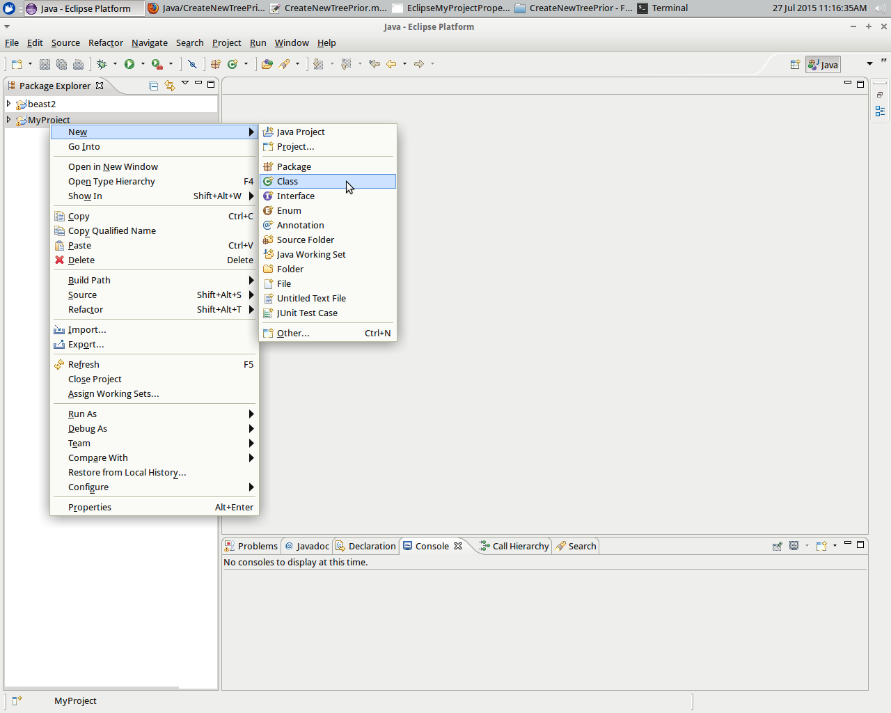
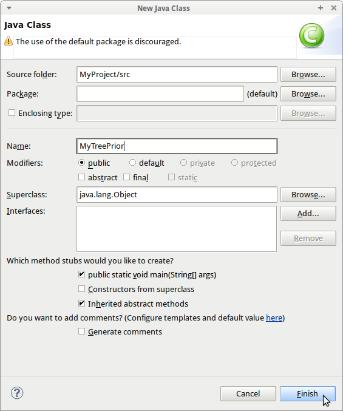
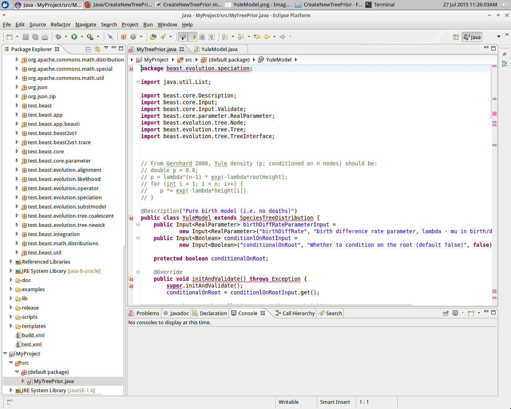
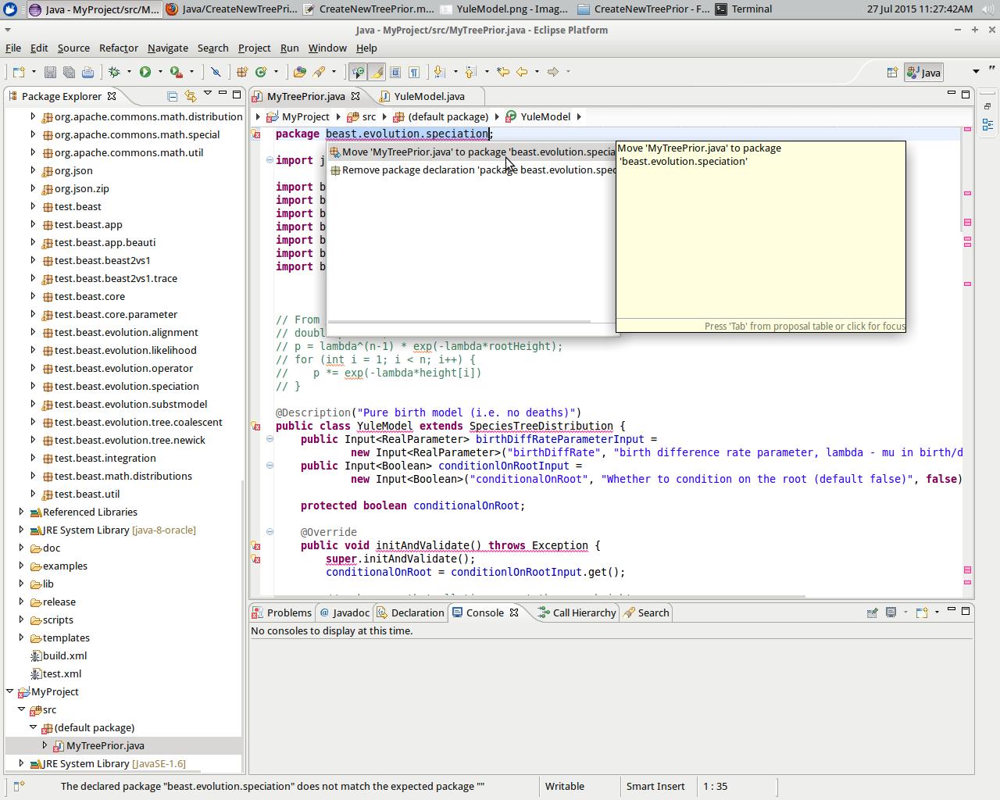
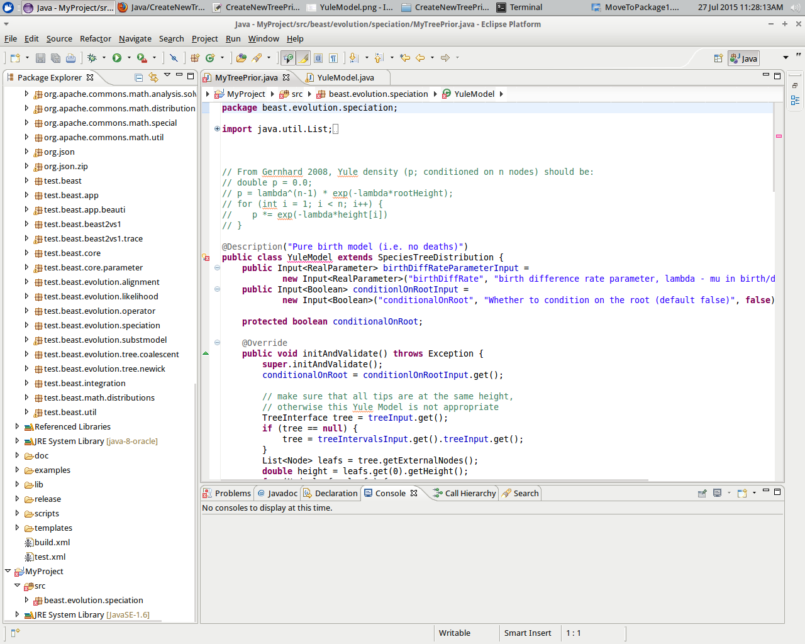
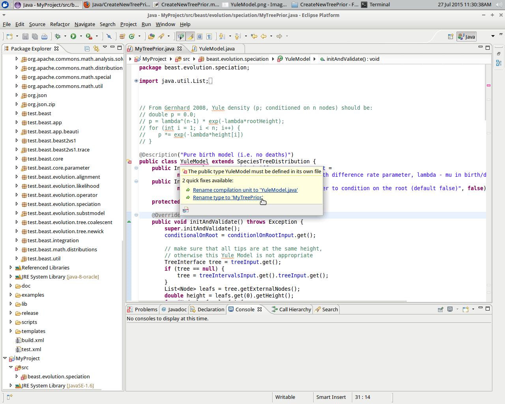
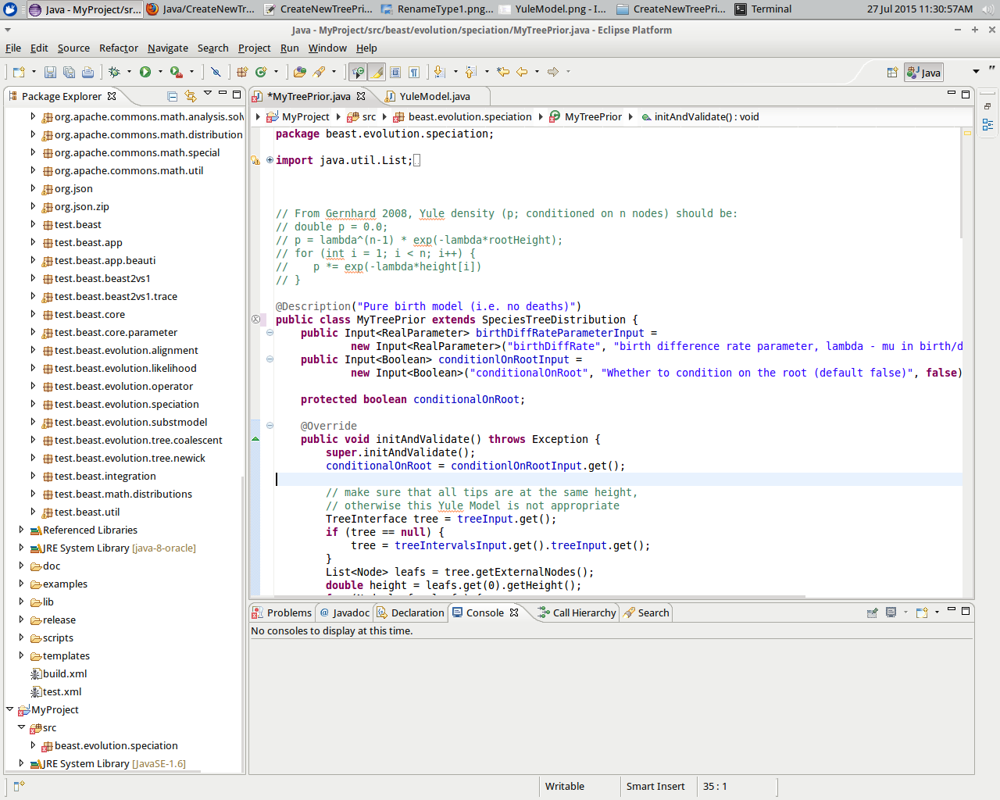

# How to add a tree prior to BEAST2?

This tutorial follows the same wording and structure as [BEAST2: how to write a BEAST2 package](http://beast2.org/writing-a-beast-2-package), but for a tree prior instead.

## Empty Package Explorer

When starting Eclipse in a new workspace, the Package Explorer is still empty. In this example, my workspace is `~/GitHubs/Java`.

## Adding BEAST2 to the Package Explorer

To add BEAST2 to the Package Explorer, it must first be downloaded, then put into a Java project.

### Download BEAST2

In this example, I download BEAST2 from the SVN repository from withing the `~/GitHubs/Java' folder:

`
cd ~/GitHubs/Java
svn checkout http://beast2.googlecode.com/svn/trunk/ beast2
`
This will create a folder called `beast2`.

### Put BEAST2 into a Java project

First, we will add `beast2` to the Package Explorer.

Select `File | New | Java Project`:

This is how the 'Create a Java Project dialog` looks like:

Just type in the word `beast`. It will detect there is a folder called `beast2` and the dialog will change:

Just press `Finish`.

Now, the Eclipse Package Explorer shows the project `beast2`. Well done!

## Creating your own project

Now you need to create an Eclipse project for your package and make it depend on the `beast2` project.

Select `File | New | Java Project`:

In `Project name`, type in the name, for example `MyProject`. For the JRE, be sure `JavaSE-1.6` or something higher is checked. Click Finish.

Now you should see two projects in the Package Explorer pane: `beast2` and `MyProject`.

## Add BEAST2 to your own project

Right-click `MyProject` and choose `Properties` from the pop-up menu that appears

Go to `Java build path | Projects` and click `Add`.

Add `beast2` to your project build path:

Now BEAST2 is in your project build path, click `OK`.

This takes you back to the Package Explorer pane.

## Create a new tree prior

To create a new tree prior, I will use the Yule model already present in BEAST2.

Select `MyProject` in the Package Explorer, right-click and select 'New | Class'

Change the class name to `MyTreePrior`. Ignore all the warnings (as we won't use the generated code anyways) and click `Finish`. 

Now you will see the initial code of `MyTreePrior`:

This initial code, however, will be replaced soon.

I will replace the initial code by the Yule tree prior. In the Package Explorer, find the Yule tree prior code. It is under `beast2 | src | beast.evolution.speciation`.

Copy-paste the source code into the `MyTreePrior` code. A lot of errors pop up that we'll fix now.

The first error suggests to put the class in the appropriate package.

Double-click this fix.

The next error is that `YuleModel` is not the correct type and Eclipse suggest to rename it to `MyTreePrior` instead.

Double-click this fix. Our class now has the correct (new) class name.

## Add the tree prior to BEAUti 

To allow BEAUti to find the new tree prior, a template XML files needs to be created. Because `MyTreePrior`
is a copy of `YuleModel`, we will use the XML code of that model as a starting point.

In the `MyProject` folder, you will need to create a `templates` folder. 
I just copied `~/GitHubs/Java/beast2/templates` to `~/GitHubs/Java/MyProject/templates`.

In that folder, only keep `SubstModels.xml` and rename it to `MyTreePrior.xml`.

It is convenient to incorporate new packages into BEAUti so that users of your package are not 
required to hand-craft an XML file. Incorporating an package into BEAUti requires adding a 
template to your package project. The template tells BEAUti what information to collect for your package.

Create a template

First, create a new folder called templates under “MyAddOn” inside the Project Explorer pane in Eclipse. The easiest way to do this is to right-click (or Control-click) the “MyAddOn” project, then choose New > Folder from the resulting popup menu.

Now create a text file within the new templates folder named F84-beauti-template.xml. The easiest way to do this is to right-click (or Control-click) the templates folder within the “MyAddOn” project, then choose New > File from the resulting popup menu, giving the new file the name “F84-beauti-template.xml”. Copy the text below into the new F84-beauti-template.xml file and save it.
<beast version='2.0' 
	namespace='beast.app.beauti:beast.core:beast.evolution.branchratemodel:beast.evolution.speciation:beast.evolution.tree.coalescent:beast.core.util:beast.evolution.nuc:beast.evolution.operators:beast.evolution.sitemodel:beast.evolution.substitutionmodel:beast.evolution.likelihood:beast.evolution:beast.math.distributions'>

	<mergewith point='substModelTemplates'>
		
		<subtemplate id='F84' class='beast.evolution.substitutionmodel.F84' mainid='F84.s:$(n)'>
		<![CDATA[
			<plugin spec='F84' id='F84.s:$(n)'>
				<parameter id="kF84.s:$(n)" name='kF84' value="2.0" lower="0.0" estimate='true'/>
				<frequencies id='estimatedFreqs.s:$(n)' spec='Frequencies'>
					<frequencies id='freqParameter.s:$(n)' spec='parameter.RealParameter' dimension='4' value='0.25' lower='0' upper='1'/>
				</frequencies>
			</plugin>
			
			<operator id='kF84Scaler.s:$(n)' spec='ScaleOperator' scaleFactor="0.5" weight="1" parameter="@kF84.s:$(n)"/>
			<operator id='FrequenciesExchanger.s:$(n)' spec='DeltaExchangeOperator' delta="0.01" weight="0.1" parameter="@freqParameter.s:$(n)"/>
				
			<prior id='kF84Prior.s:$(n)' x='@kF84.s:$(n)'>
				<distr spec="LogNormalDistributionModel" meanInRealSpace='true'>
					<parameter name='M' value="1.0" estimate='false'/>
					<parameter name='S' value="1.25" estimate='false'/>
				</distr>
			</prior>
		]]>
		
		<connect srcID='kF84.s:$(n)' targetID='state' inputName='stateNode' if='inposterior(F84.s:$(n)) and kF84.s:$(n)/estimate=true'/>
		<connect srcID='freqParameter.s:$(n)' targetID='state' inputName='stateNode' if='inposterior(F84.s:$(n)) and inposterior(freqParameter.s:$(n)) and freqParameter.s:$(n)/estimate=true'/>
		<connect srcID='kF84Scaler.s:$(n)' targetID='mcmc' inputName='operator' if='inposterior(F84.s:$(n)) and kF84.s:$(n)/estimate=true'>Scale F84 transition-transversion parameter of partition $(n)</connect>
		<connect srcID='FrequenciesExchanger.s:$(n)' targetID='mcmc' inputName='operator' if='inposterior(F84.s:$(n)) and inposterior(freqParameter.s:$(n)) and freqParameter.s:$(n)/estimate=true'>Exchange values of frequencies of partition $(n)</connect>
		<connect srcID='kF84.s:$(n)' targetID='tracelog' inputName='log' if='inposterior(F84.s:$(n)) and kF84.s:$(n)/estimate=true'/>
		<connect srcID='freqParameter.s:$(n)' targetID='tracelog' inputName='log' if='inposterior(F84.s:$(n)) and inposterior(freqParameter.s:$(n)) and freqParameter.s:$(n)/estimate=true'/>
		<connect srcID='kF84Prior.s:$(n)' targetID='prior' inputName='distribution' if='inposterior(F84.s:$(n)) and kF84.s:$(n)/estimate=true'>F84 transition-transversion parameter of partition $(n)</connect>
		
		</subtemplate>
	</mergewith>
</beast>
1
2
3
4
5
6
7
8
9
10
11
12
13
14
15
16
17
18
19
20
21
22
23
24
25
26
27
28
29
30
31
32
33
34
35
36
	
<beast version='2.0' 
	namespace='beast.app.beauti:beast.core:beast.evolution.branchratemodel:beast.evolution.speciation:beast.evolution.tree.coalescent:beast.core.util:beast.evolution.nuc:beast.evolution.operators:beast.evolution.sitemodel:beast.evolution.substitutionmodel:beast.evolution.likelihood:beast.evolution:beast.math.distributions'>
 
	<mergewith point='substModelTemplates'>
		
		<subtemplate id='F84' class='beast.evolution.substitutionmodel.F84' mainid='F84.s:$(n)'>
		<![CDATA[
			<plugin spec='F84' id='F84.s:$(n)'>
				<parameter id="kF84.s:$(n)" name='kF84' value="2.0" lower="0.0" estimate='true'/>
				<frequencies id='estimatedFreqs.s:$(n)' spec='Frequencies'>
					<frequencies id='freqParameter.s:$(n)' spec='parameter.RealParameter' dimension='4' value='0.25' lower='0' upper='1'/>
				</frequencies>
			</plugin>
			
			<operator id='kF84Scaler.s:$(n)' spec='ScaleOperator' scaleFactor="0.5" weight="1" parameter="@kF84.s:$(n)"/>
			<operator id='FrequenciesExchanger.s:$(n)' spec='DeltaExchangeOperator' delta="0.01" weight="0.1" parameter="@freqParameter.s:$(n)"/>
				
			<prior id='kF84Prior.s:$(n)' x='@kF84.s:$(n)'>
				<distr spec="LogNormalDistributionModel" meanInRealSpace='true'>
					<parameter name='M' value="1.0" estimate='false'/>
					<parameter name='S' value="1.25" estimate='false'/>
				</distr>
			</prior>
		]]>
		
		<connect srcID='kF84.s:$(n)' targetID='state' inputName='stateNode' if='inposterior(F84.s:$(n)) and kF84.s:$(n)/estimate=true'/>
		<connect srcID='freqParameter.s:$(n)' targetID='state' inputName='stateNode' if='inposterior(F84.s:$(n)) and inposterior(freqParameter.s:$(n)) and freqParameter.s:$(n)/estimate=true'/>
		<connect srcID='kF84Scaler.s:$(n)' targetID='mcmc' inputName='operator' if='inposterior(F84.s:$(n)) and kF84.s:$(n)/estimate=true'>Scale F84 transition-transversion parameter of partition $(n)</connect>
		<connect srcID='FrequenciesExchanger.s:$(n)' targetID='mcmc' inputName='operator' if='inposterior(F84.s:$(n)) and inposterior(freqParameter.s:$(n)) and freqParameter.s:$(n)/estimate=true'>Exchange values of frequencies of partition $(n)</connect>
		<connect srcID='kF84.s:$(n)' targetID='tracelog' inputName='log' if='inposterior(F84.s:$(n)) and kF84.s:$(n)/estimate=true'/>
		<connect srcID='freqParameter.s:$(n)' targetID='tracelog' inputName='log' if='inposterior(F84.s:$(n)) and inposterior(freqParameter.s:$(n)) and freqParameter.s:$(n)/estimate=true'/>
		<connect srcID='kF84Prior.s:$(n)' targetID='prior' inputName='distribution' if='inposterior(F84.s:$(n)) and kF84.s:$(n)/estimate=true'>F84 transition-transversion parameter of partition $(n)</connect>
		
		</subtemplate>
	</mergewith>
</beast>

Run BEAUti

To create a debug configuration that runs BEAUti, choose Run > Debug Configurations… from the main Eclipse menu. In the Debug Configurations dialog, select Java Application and click the New launch configuration button. In the Name field at the top of the dialog box, type “BEAUti”. In the Project field of the Main tab, type (or use the Browse… button to select) “MyAddOn”. For the Main class, type “beast.app.beauti.Beauti”.

Now you should be able to click the Debug button to run BEAUti. Try using the following steps to generate a BEAST 2 XML file:

o Click the + button at the lower left, then navigate to the beast2/examples/nexus folder and select the anolis.nex file. (You can avoid doing this step if you specify “-nex ../beast2/examples/nexus/anolis.nex” in the “Program arguments” field of the Arguments tab in the BEAUti debug configuration.)

o Click the Site Model tab and select the new F84 model in the Subst Model drop down list

o Click the MCMC tab, and set Chain Length to 1000000 (the default is 10 million, which will take longer than you probably want to wait for a test example)

o Expand the tracelog logger and make sure Log Every is set to 1000

o Use File > Save As… to save the XML file under the name f84example.xml in the MyAddOn/examples folder