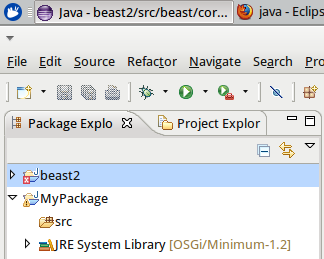
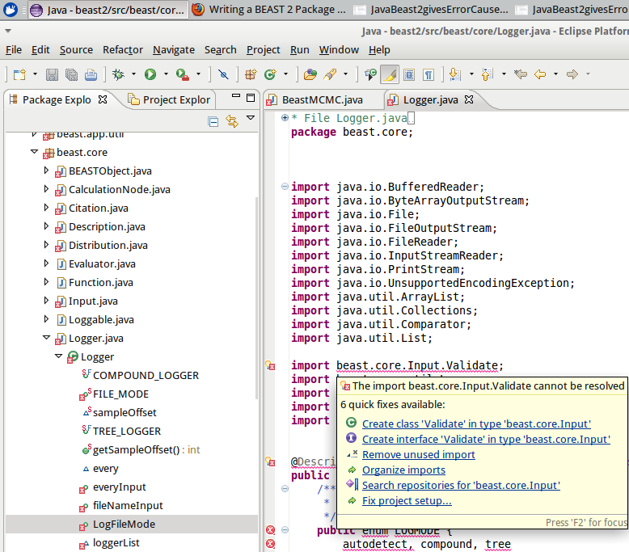
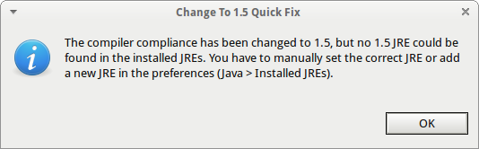

# BEAST2 error 1

I followed the instructions on [the BEAST2 ](http://beast2.org/writing-a-beast-2-package). 

```
Creating a BEAST 2 project

Back in Eclipse, use File > New > Project... > Java project to create a new Java project 
named 'beast2'. You should be able to leave everything in the New Java Project dialog 
box at its default value. Once you press the Finish button, Eclipse will proceed
to compile 'beast2'.
```

The first incation of the error was visible in the Package Explorer:



I zoomed in to the first error:


`beast.core.Logger.LogFileMode` gave an error, so I looked that one up:



`beast.core.Input.Validate` appeared to be the cause of that error, so I looked that one up:


Ah, the true error! I did get another error message:



But hey, the error is fixed.