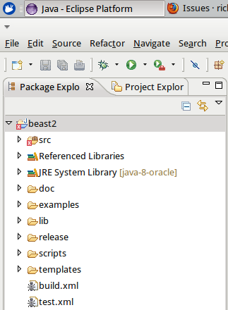

# BEAST2 error 2

I followed the instructions on [the BEAST2 ](http://beast2.org/writing-a-beast-2-package) 
and solved the [first BEAST2 error](JavaBeast2Error1.md).

The first incation of the error was visible in the Package Explorer:



I zoomed in to the first error:


## Failed attempt: choosing the quick fix

Do not choose the quick fix: chosing the quick fix makes the error go away. But this just gives the illusion it is fixed: you will need to do this many many additional times. Better to solve the root cause.

## Another failed attempt

I though I might needed to install the Swing library:

Installing: 

```
sudo apt-get install openjdk-7-jre
```

Following the steps [here](http://www.eclipse.org/swt/eclipse.php) and adding `org.eclipse.swt` to the project did not work.

