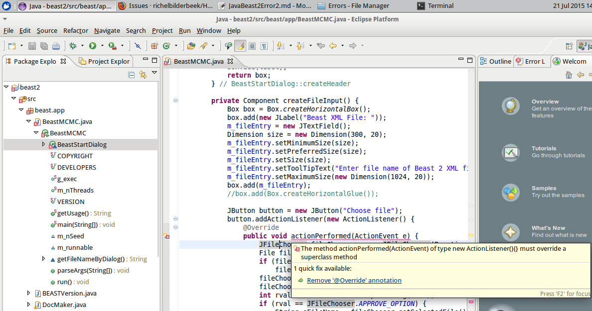

# BEAST2 error 2

I followed the instructions on [the BEAST2 ](http://beast2.org/writing-a-beast-2-package). 
and solved the [first BEAST2 error](JavaBeast2Error1.md).

The first incation of the error was visible in the Package Explorer:

I zoomed in to the first error:

Chose the quick fix and it worked.